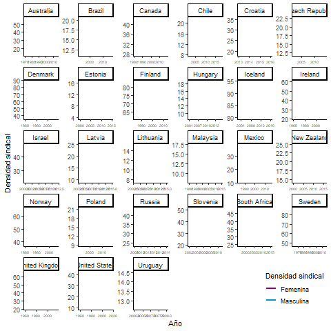
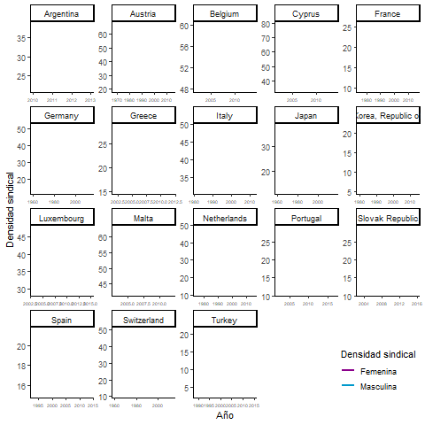
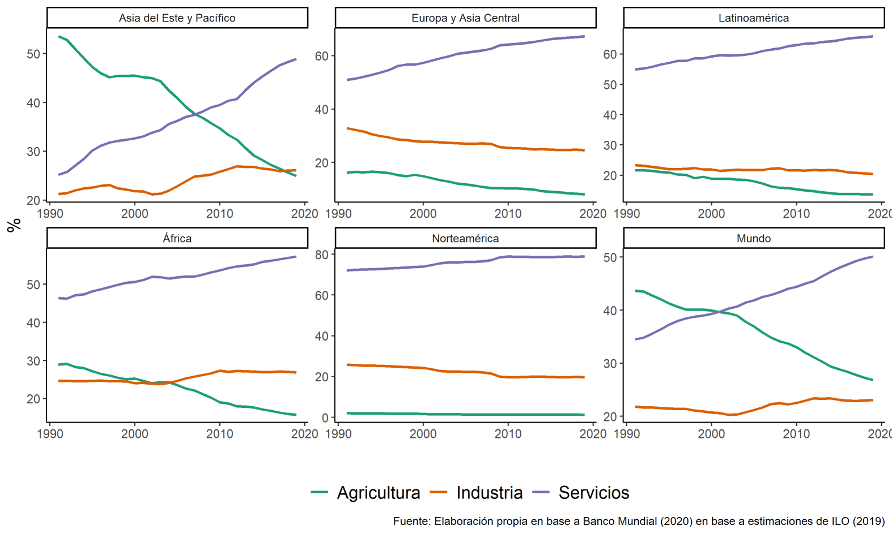
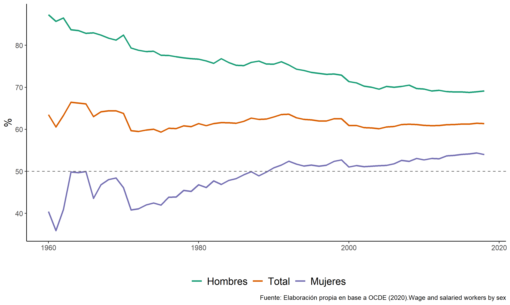
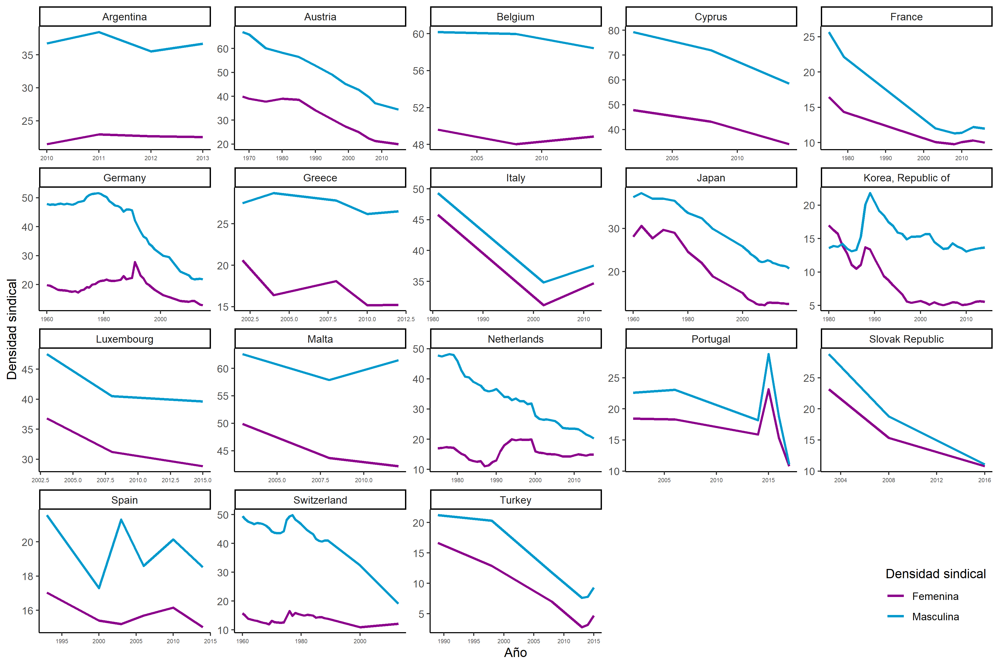
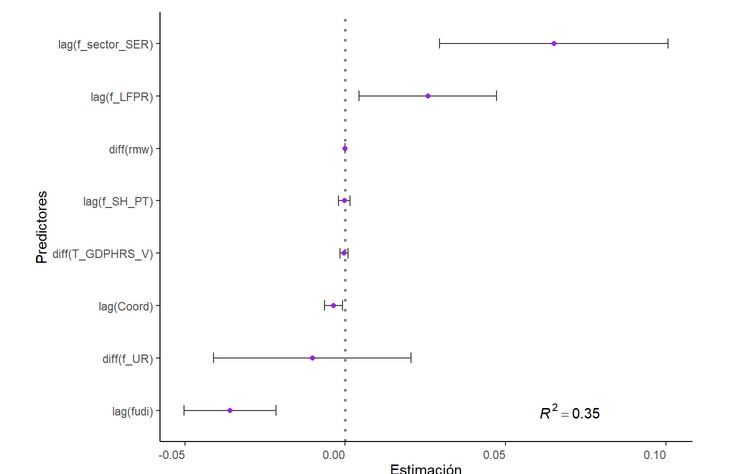
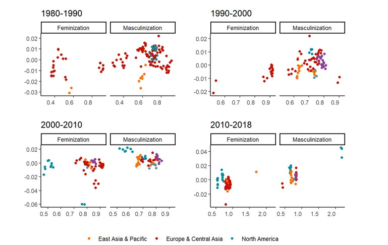
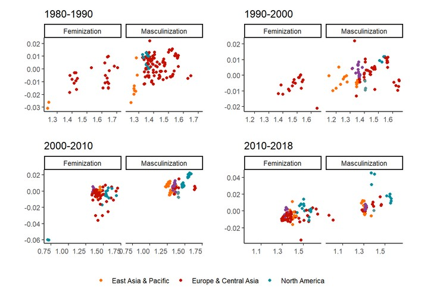

```{r setup, include=FALSE}
knitr::opts_chunk$set(warning = FALSE, message = FALSE, 
                      fig.retina = 3, fig.align = "center")
```

```{r packages-data, include=FALSE}
pacman::p_load(ecm,# Error correction model
               tseries,
               vars, # augmented Dickey-Fuller test
               urca, # Philips y Ouliaris test cointegration
               panelvar, # PVAL
               plm, #poleed data model
               lmtest,
               texreg,
               ggplot2,
               GGally,
               pcse) 
#1.1 Manipulacion general
pacman::p_load(icons, tidyverse, ggthemes, flair, texreg,ggplot2,
               "haven","forcats","ggsci",
               "hrbrthemes",
               "gganimate", "broom", "plotly", "magick",
               "png","gifski", "dygraphs") #interactive 

#1.2 Manipulacion de mapas
pacman::p_load(sf,raster,spData,
               "rgdal","leaflet", "htmlwidgets", "tmap", "mapview", "shiny", "maps")

load(file = "../output/data/models.RData")
load(file = "../output/data/ajust-model.RData")
load(file = "../output/data/db-proc.RData")
```
```{r xaringanExtra, echo=FALSE}
xaringanExtra::use_xaringan_extra(c("tile_view", "animate_css", "share_again", "scribble"))
```
class: center middle main-title section-title-2

# La feminización del conflicto laboral


.class-info[

**Un análisis temporal y comparado de la densidad sindical mundial**

</br>

**Defensa de Tesis para optar al grado de Socióloga**

.light[Valentina Andrade de la Horra<br>
.small[Facultad de Ciencias Sociales, Universidad de Chile<br>
Marzo 2021]
]
]
</br>
.right.tiny[Profesor Guía: Dr. Omar Aguilar Novoa </br>
Co-tutor: Dr. Pablo Pérez Ahumada </br>
Comisión: Dra. Catalina Arteaga y Dr. (c) Giorgio Boccardo]

---
class: center middle section-title section-title-2 animated fadeInUp

# 1. Problema de investigación

---
class: title title-inv-2

# 1. Problema de investigación

--


.box-4.medium.sp-after-half[Declive de la densidad sindical]

--

.box-2.small.sp-after-half[(1) variación en **composición del empleo** (por reestructuración productiva) .tiny[(Pencavel, 2005)]]

--

.box-2.small.sp-after-half[(2) mercados más proclives al desempleo e informalidad (por internacionalizacion-globalización) **ciclos economicos** .tiny[(Blanchard y Wolfers 2000; Vachon, Wallace, y Hyde 2016)]]

--

.box-2.small[(3) implementación de **políticas** menos laboralistas .tiny[(Disney, 1990 y Ebbinghaus, Göbel, y Koos 2011)]]


---
class: center middle section-title section-title-2 
# Nuevas tendencias: Organización sindical de mujeres


---
class: title title-2

.small[ 
# 1. **Sindicalización femenina supera a la masculina**
]

.left-code[

.box-inv-3.small[Países feminizados]
]


.right-plot[

.box-inv-1.small[Países sin feminización]
]

---
class: title title-2

# 2. Feminización de la densidad sindical

.center[
```{r map1, results='asis', echo= F}
# Final Map
load(file = "../output/graphs/map.RData")
map2
```
]

---

class: center

.box-4.medium.sp-after-half[Qué dice la literatura]

--

.left-code[
.box-inv-1[**Sex blinded**<br> Si bien el el grueso la actividad sindical iba en declive, cuando se disgregaba la tendencia por sexo, *el escenario no era tan concluyente*]
]

--


.left-code[
.box-inv-4[**Class blinded**</br>
Las mujeres como estructuralmente imposibilitadas de participar, menos militantes y pasivas ante el conflicto laboral (Milkman, 1990)
]
]

---

class: center middle section-title section-title-2 animated fadeIn

# 2. Objetivo

.box-2.small.sp-after-half[Analizar la relación entre los cambios en la densidad sindical por sexo y determinantes económicos-laborales a nivel mundial entre 1980-2018]


---
class: center middle section-title section-title-2 animated fadeInDown

.left-code[.box-inv-2.huge[**Cíclos económicos**]]
</br>
.right-code[.box-inv-2.huge[**Estructurales**]]
</br>


.middle-code[.box-inv-2.huge[**Institucionales**]]
</br>
</br>
.box-inv-3[.small[En cómo podrían afectar a **mujeres** y su relación con los **sindicatos**]]
---
class: center middle section-title section-title-2 
.small[
.left-code[.box-inv-2[**Cíclos económicos**]
`r icons::fontawesome("arrow-down", style = "solid")`
.box-inv-5[Hipótesis 1]
.box-inv-5.small[A corto plazo se espera que, en periodos de alto aumento del desempleo, el desempleo masculino aumentará y el de mujeres disminuirá. Así, las mujeres aumentarán su sindicalización debido a que el aumento de su empleabilidad estará asociada a puestos precarios y con brechas salariales altas, lo que, en consecuencia, las llevará a sindicalizarse como un modo de resguardar sus condiciones laborales.
]]
</br></br></br></br>
.right-code[.box-inv-2[**Institucionales**]
`r icons::fontawesome("arrow-down", style = "solid")`
.box-inv-5[Hipótesis 3]
.box-inv-5.small[Instituciones laborales como la coordinación salarial y la extensión de la negociación colectiva **mediarán el efecto del aumento de la participación laboral y desempleo femenino**, en la medida en que, si la participación laboral femenina aumenta y no hay presencia de estas, más mujeres se sindicalizarán de modo de mejorar sus condiciones de trabajo.
]]

]
---
class: center middle

.middle-code[.box-inv-5[**Estructurales**]
`r icons::fontawesome("arrow-down", style = "solid")`
.box-inv-2[Hipótesis 2]
.box-inv-2[La feminización en la fuerza de trabajo, a largo plazo producirá un cambio en la composición sexual sindical que, por un lado, va a producir un **aumento de la densidad sindical femenina** y por otro una salida (‘*exit*’) de la membresía masculina. En suma y resta, la sindicalización se feminizará.
]]

---
class: center middle section-title section-title-5 animated fadeIn

.tiny[
# Hoy, la **fuerza laboral del sindicalismo es la mujer**, y lo que ha llevado a las mujeres hacia la organización sindical tiene que ver más con la **ubicación** que las mujeres han comenzado a ocupar en el **mercado laboral**
]
---
class: title title-5
.tiny[
# 1. La tendencia hacia la feminización del empleo remunerado ha ido al alza
]
.small[
.box-inv-5[Industrial masculinizada `r icons::fontawesome("arrow-right", style = "solid")` Servicios feminizada]
.center[
]]
.very-tiny[Figura 5. Evolución del empleo según sector económico (1990-2019).] 

---
class: title title-5
.tiny[
# 2. El sector servicios y empleo part time ha ido en expansión, sectores que son la principal inserción de las mujeres
]
.center[
]
.very-tiny[Figura 6.Participación en el trabajo asalariado y empleo parcial según sexo a nivel mundial (1960-2020)] 

---
class: title title-5
.tiny[
# 2. El sector servicios y empleo part time ha ido en expansión, sectores que son la principal inserción de las mujeres
]

.left-code[.box-inv-1[Bajos salarios].box-inv-2[Jornadas flexiprecarias].box-inv-3[Sin protección social].box-inv-4[Informalidad]]

.box-inv-4[Servicios financieros].box-inv-5[Servicios sociales].box-inv-6[Educación].box-inv-7[Salud]
</br>
.box-5.large[Empleo **pink collar**]
---

class: center middle section-title section-title-5 animated fadeIn

.left-code[.box-inv-5[Feminización de la fuerza de trabajo </br>`r icons::fontawesome("arrow-down", style = "solid")` </br> Empleos flexibles y precarios</br></br>]]


.right-code[.box-inv-6[La fuerza laboral del sindicalismo es la mujer </br> `r icons::fontawesome("arrow-down", style = "solid")` </br>Sindicalismo como motor para canalizar demandas]]

---
class: center middle section-title section-title-5 animated fadeIn

.tiny[
# Tensión entre la estructura tradicional sindical dominada por hombres y la **progresiva incorporación femenina al mundo sindical**
]
---
class: title title-5
.tiny[
# 3. Cambio en la estructura sindical tradicional masculina a una femenina
]
.center[
]


---
class: center middle section-title section-title-8 animated fadeIn

# 3. Método

---
class: title title-8
.tiny[
# **Datos y variables**
]
.very-tiny[
| Variable    | Descripción|       Fuente|
|------------|:-----------:|------------|
| |**Variable dependiente**  |           |
| Índice de Feminización de Densidad Sindical $FUDi$ | $FUDi$ = $\frac{\frac{NUM_f*100}{WSEE_f}}{\frac{NUM_m*100}{WSEE_m}} = \frac{UD_f}{UD_m}$  |  Elaboración propia en base a encuestas de hogares, datos administrativos y ICTWSS (2019) |
| |**Variables independientes** |          |
| **A. Cícilicas**|          |              |
| Feminización Desempleo Femenino|   Proporción entre el porcentaje  anual de desocupadas y desocupados del total de la fuerza de trabajo por sexo.      |OCDE (2020)  |
| Salarios Mínimos Reales| Salarios mínimos legales convertidos en un salario común por hora y período de pago anual convertido en una unidad monetaria común utilizando las Paridades de Poder Adquisitivo ($PPP$) | OCDE (2020) |
| **B. Estructuales**|         |       |
| Feminización de la participación laboral| Proporción entre la fuerza de trabajo femenina dividida por su PEA y la fuerza de trabajo masculina divida por su PEA. | Encuestas a Fuerza de Trabajo (*LFS*)|
| Feminización Sector servicios| Proporción por sexo de la tasa anual de la fuerza de trabajo en el sector servicios (secciones económicas que van de la G a la U en ISIC rev.4) |  ILO (2019)|
| Feminización Empleo parcial| Proporción por sexo del porcentaje de trabajadores parciales en el total de los asalariados de cada país.  |  Encuestas a Fuerza de Trabajo (*LFS*) |
| **C. Institucionales**|          |              |
| Coordinación salarial | Negociación de normas relativas a tasas de salario máximo o mínimo, donde (5) es resultado de la negociación centralizada entre central sindical y las asociaciones patronales, con o sin la participación del gobierno y (1) negociación salarial fragmentada, limitada a empresas | ICTWSS (2019) |
| **D. Control** |          |              |
| Ajuste de la Negociación Colectiva |  Empleados cubiertos por acuerdos de negociación colectiva  válidos como proporción de todos los asalariados con derecho a negociar, expresada como porcentaje |ICTWSS (2019)|
| Densidad Sindical|  Membresía sindical en proporción a todos los asalariados del año anterior disponible |  ICTWSS (2019)|
]

---
class: title title-8

# Modelo ECM

- Análisis de series de tiempo y transversal para 45 países durante 1980 a 2018, o 2,128 países-años

.tiny[
| Característica   | Ventaja | 
|------------|-----------|
| Modelo de cambio|variables ‘cíclicas’ y las ‘estructurales’ (Checchi y Visser 2005; Disney 1990)|
| Modelo con tendencias |modelamiento con cointegración (Beck y Katz 2011) |
| Errores estándares corregidos |  corrección la heteroscedasticidad producida por sesgo de selección y paneles desbalanceados(cf. Beck y Katz 1995)|
| Autorregresivo de primer orden | se estima la media de la variable dependiente  FUDI según la media de sus observaciones pasadas  (Vachon, Wallace, y Hyde 2016) |
| Otros | Efectos fijos, punto de equilibrio e imputación
]
---
class: title title-8

# Modelo ECM
</br>
.small[
$\triangle FUDI_{i,t} = \beta_1^{-1}\alpha_1,i + t- \beta_1^{-1}(1-\beta_1)\triangle FUDi_{i,t}+ \beta_1^{-1}\beta_2X_{i,t-1}+ \epsilon_{i,t}$
]

</br>
.tiny[
Donde,

- $\triangle FUDi_{t}$ representa la primera diferencia entre $FUDi_{t}$ y $FUDi_{t-1}$

- $i$ representa cada uno de los países

- $\alpha_1,i$ representa la desviación en el tiempo para cada país

- $\beta_1$ representa la tasa de ajuse o correción de errores de $FUDi$

- $\beta_2$: efecto directo de la variable $X_{i,t-1}$ sobre $\triangle FUDi$

- $X_{i,t-1}$: determinate de la densidad sindical
]

---
class: center middle section-title section-title-1 animated fadeIn

# 4. Resultados

---
class: title title-1

# Descriptivos - países feminizados
.center[

]
---
class: title title-1
# Descriptivos - países sin feminización
.center[

]

---
.very-tiny[
```{r model2, results='asis', echo= FALSE, message= FALSE, warning= FALSE}
vars <- c("diff. Fem. Desempleo","diff. Productividad laboral","diff. Salarios Mínimos Reales","Lag Fem. Participación Laboral", "Lag Fem. Sector Servicios", "Lag Fem. Incidencia empleo part-time", "Lag Coordinación Salarial", "Lag(FUDi)")
knitreg(list(model02, coeftest(model32,vcov=function(x)vcovBK(x, type="HC1", cluster="time")), coeftest(model04,vcov=function(x)vcovBK(x, type="HC1", cluster="time"))), stars = c(0.01, 0.05, 0.107),
        custom.header = list("Modelo 2" = 1:3),custom.model.names = c('Mundial', 'Latinoamérica', "Europa"), custom.coef.names = vars, include.rsquared = F,  include.sig= T, include.adjrs = F, include.nobs = F,
        custom.gof.rows=list("Adj. R^2" = c(0.351,0.272,0.141),
                             "N obs" = c(661,132,271)), custom.note = "$^{***}$ p < 0.01; $^{**}$ p < 0.05; $^{*}$ p < 0.1\n**Nota**: a. Coeficientes a corto (diff) y largo plazo (lag) (errores panel corregidos entreparéntesis) \nb. Variables incluidas en el modelo pero no son mostradas son efectos fijos por países y controles estadísticos como densidad sindical nacional y cobertura de la negociación colectiva; \nc. Modelo autoregresivo de primer orden con errores corregidos específicamente para panel desbalanceado, por método de Beck y Katz (1995) (Panel Cluster Error Correction); \nd. Coeficientes son estadísticamente significativos según test de Wald (test de dos colas)",caption.above = T, center = TRUE,
  caption="Tabla 3.2. Modelos Panel Autoregresivos con Error de Corrección para predecir la Feminización de la sindicalización en 45 países, 1980-2018, Efectos a corto y largo plazo  [$^{a,b,c}$]",
  label="tab:model2")

```
]

---
class: title title-1

.small[
# Modelo de Feminización de la Densidad Sindical



.tiny[Figura 7. Tamaño efecto y significancia de coeficientes del modelo mundial para estimar la feminización de la sindicalización.] 
]

---

class: center middle section-title section-title-2 animated fadeIn

# 5. Discusión y conclusiones

.left-code[.box-inv-2[(1) El aumento de la participación laboral femenina y la **feminización del empleo**]]
</br>
.right-code[.box-inv-2[(2) La expansión del **sector servicios y empleo part time**, siendo este la principal inserción de las mujeres]]
</br>

.middle-code[.box-inv-2.large[(3) **Feminización densidad sindical**]]
</br>

---
class: title title-2
.small[
# (1) Feminización de la participación laboral
.center[

]]
---
class: title title-2
.small[
# (2) Feminización del sector servicios
.center[

]]

---
class: center middle section-title section-title-2 animated fadeIn

# ¿Sindicalismo de mujeres?

---
class: center middle section-title section-title-2

.box-inv-2.large[Women Structures .tiny[(Parker y Douglas 2010; Haile 2017)]]

--

.box-inv-2.medium[Women-only .tiny[(Broadbent 2005, 2007)]]

--


---
class: center middle section-title section-title-2 animated fadeIn

# ¿Son las **pink collars** la nueva clase trabajadora?

---
class: center middle main-title section-title-2

# La feminización del conflicto laboral


.class-info[

**Un análisis temporal y comparado de la densidad sindical mundial**

</br>

**Defensa de Tesis para optar al grado de Socióloga**

.light[Valentina Andrade de la Horra<br>
.small[Facultad de Ciencias Sociales, Universidad de Chile<br>
Marzo 2021]
]
]
</br>
.right.tiny[Profesor Guía: Dr. Omar Aguilar Novoa </br>
Co-tutor: Dr. Pablo Pérez Ahumada </br>
Comisión: Dra. Catalina Arteaga y Dr. (c) Giorgio Boccardo]

---
class: bg-full bg-y-75
background-image: url("img/women.jpg")
background-position: center
background-size: cover
<font color = "white">
# La feminización del conflicto laboral
.center[

**Un análisis temporal y comparado de la densidad sindical mundial**


</br></br>
Valentina Andrade de la Horra<br>

.light[Facultad de Ciencias Sociales, Universidad de Chile<br>
Marzo 2021]

[`r icons::icon_style(simple_icons("github"), scale = 2, fill = "white")`](https://github.com/valentinaandrade)
[`r icons::icon_style(academicons("osf"), scale = 1, fill = "white")`](https://osf.io/3rb68/)
[`r icons::icon_style(fontawesome("globe"), scale = 2, fill = "white")`](https://github.com/valentinaandrade)
]

