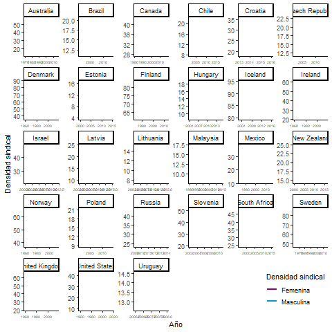
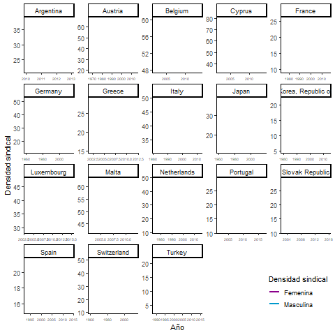

# ¿Más mujeres en los sindicatos? {#intro}

```{r set up, include = F}
#1.1 Manipulacion general
pacman::p_load("tidyverse","dplyr","ggplot2",
               "haven","forcats","ggsci",
               "hrbrthemes",
               "gganimate", "broom", "plotly", "magick",
               "png","gifski", "dygraphs") #interactive 

#1.2 Manipulacion de mapas
pacman::p_load("sf","raster","spData","spDataLarge",
               "rgdal","leaflet", "htmlwidgets", "tmap", "mapview", "shiny", "maps")


#2. Cargar bases de datos
load(file = "../output/data/db-proc.RData")

```


## El problema sobre la sindicalización de mujeres

  Trabajadoras del aseo, teleoperadoras de centros de llamado, trabajadoras de hospitales,  maestras, empleadas bancarias, vendedoras, cajeras, cocineras, trabajadoras domésticas. Hoy, todas ellas son fuerza de trabajo de los servicios. Antes, probablemente hijas y nietas de lavanderas, obreras textiles o dueñas de casa. El evidente desplazamiento hacia la tercerización y feminización de la fuerza de trabajo deja abierta la pregunta a si estos cambios tuvieron un correlato en el conflicto laboral y en la formación de la clase trabajadora. ¿Es posible pensar que hoy hay más mujeres en los sindicatos que en décadas anteriores? 

  Antes de sumar uno más uno – o, en otras palabras, determinar como causa de la mayor participación sindical de mujeres su mayor participación en el mercado de trabajo– no es menor destacar que lo que llama la atención de la crisis de la sociedad industrial es la supuesta muerte anunciada del proletariado. Las relaciones laborales habrían cambiado a tal punto que el antagonismo entre la clase capitalista y los trabajadores se habría transformado radicalmente: el fin del obrero hombre asalariado clásico sería en fin de la organización de la clase trabajadora tal como la conocíamos [@pakulski1996]. Porque la desindustrialización sería el fin del trabajo, y con ello, el fin de la clase trabajadora y su acción colectiva. En consecuencia, los servicios no serían un trabajo, sus empleadas no serían parte de una clase, y mucho menos tendrían capacidad de organización. 

  Para los expertos en relaciones laborales, en ningún caso el desplazamiento de los hombres desde las principales fuentes de trabajo implicó que, más mujeres se insertarían en el mercado laboral, por lo que el razonamiento de que ellas ahora serían las principales actoras sindicales ni si quiera aparece. Más bien, las investigaciones se han centrado en el declive de la acción sindical [@vachon2016; @western1995]. @pencavel2005, en esta línea, muestra como a nivel global se dan una serie de transformaciones que parecen debilitar el poder de los sindicatos. Dentro de estas se ponen de relieve las variaciones en la composición del empleo, como el aumento de trabajadores *white collars* y el aumento de la participación femenina en el empleo de la mano con el trabajo *part time*. También, se señala la reestructuración hacia mercados de trabajo más internacionalizados, liberalizados, con crecimiento económico menos acelerado, que han producido mayores tasas de desempleo e informalidad [@blanchard2000;@vachon2016]. Y, por último, se ha señalado la implementación de políticas laborales cada vez menos amigables con el sindicalismo [@disney1990], como la descentralización de las negociaciones colectivas [@calmfors1988a], la eliminación de los *closed shops* [@ebbinghaus2011; @pencavel2004] y la desregulación del empleo [@vallas1996]. 

  A partir de la década del noventa, el diagnóstico del descenso de la afiliación sindical a nivel mundial se volvió una realidad indiscutida en la literatura especializada: en 1978 casi la mitad de los asalariados participaba en un sindicato, mientras que treinta años después la sindicalización solo alcanzó a un 23% [@bryson2011]. Es amplia la evidencia que señala que esta baja en la sindicalización fue un fenómeno que no discriminó entre países desarrollados y en vías de desarrollo[^1]  [@blanchflower2006].

  El centro fue ese desoldador escenario, donde los estudios laborales se volcaron explicar la erosión del sindicalismo a nivel mundial[^2]. Se esbozaron una serie de críticas sobre la capacidad de los sindicatos de representar al nuevo trabajador marginal, no calificado y sin contrato  [@visser2012]. Pero este enfoque no solo se dio desde las llamadas investigaciones “ciegas al género”. Incluso la negación a la acción colectiva de mujeres ha llegado a tal punto que las estudiosas sobre sindicatos y mujeres se han centrado en explicar la exclusión y marginación de estas [@diaz2005;@godinho-delgado1990; @healy2013;@kirton2013a] más que su posible mayor participación en el conflicto laboral o las particulares formas en las que han hecho. 

  Así como el fin de la clase trabajadora fue un precipitado augurio, el declive del sindicalismo puede ser puesto en tela de juicio, ya que, a partir de la década del 2000, comenzaron a surgir  nuevas tendencias y oportunidades  [@artus2015]. contrario a lo que se había señalado hasta ahora en la literatura tradicional sobre sindicalización[^3], no solo hay más mujeres en los sindicatos de diversos países, sino que inclusive se ha feminizado la densidad sindical: el siglo XXI se inaugura con un nuevo sindicalismo, el sindicalismo de mujeres.


```{r gif1, echo = F, results='asis',fig.cap="(ref:gif1)"}

# if (knitr:::is_latex_output()) {
#   knitr::asis_output('\\url{....}')
# } else {
#   knitr::include_graphics("gifs/forget_copy.gif")
# }
# 
```


(ref:gif1) Evolución de la densidad sindical por sexo, países feminizado. Fuente: Elaboración propia en base a encuestas de hogares e ICTWSS -@visser2019

```{r gif2, echo = F, fig.cap="(ref:gif2)"}

```


(ref:gif2) Evolución de la densidad sindical por sexo, países masculinizados. Fuente: Elaboración propia en base a encuestas de hogares e ICTWSS -@visser2019

  Ciertamente en la mayoría de los países los hombres tienen en términos absolutos una participación mayor en las organizaciones de trabajadores  [@visser2015], en tanto su participación en el mercado de trabajo es mayor. Pero si ponemos a las mujeres sindicalizadas en proporción a cuántas de estas participan en el mercado laboral se puede notar con creces que a nivel mundial las mujeres progresivamente han aumentado su participación sindical [@hassel2019; @visser2019]. En otras palabras, la densidad sindical de las mujeres ha aumentado (Figura \@ref(fig:gif1)). La feminización de la sindicalización, es decir, donde la proporción de sindicalización femenina ha superado a la masculina, se puede observar en países tan diversos como Inglaterra, Suecia, Noruega, Estonia, Finlandia, Canadá, Australia, Rusia (y los países excomunistas en general), Islandia, Nueva Zelanda, Dinamarca, México, Brasil y Chile, los cuáles se presentan a modo de ejemplos el Figura \@ref(fig:map1). O incluso, en países como Estados Unidos la brecha de participación sindical por sexo ha disminuido año a año [@milkman2007]. De hecho, resulta más sencillo y simple notar las excepciones de países donde la masculinización de la sindicalización sigue vigente: Francia, Alemania, Corea, Japón, Bélgica, Austria, Colombia y Argentina (Figura \@ref(fig:gif2)).


```{r mapa, echo = T, include = F, message=FALSE, warning=FALSE}
# 4. Manipular base de datos
db <- db %>% dplyr::select(country, year,UD, ud_fem2, ud_male2)
db1 <- db %>% fill(UD) %>% filter(!is.na(ud_fem2))%>% 
  group_by(country) %>%
  filter(year == max(year)) %>% mutate(fudi = ud_fem2 / ud_male2) %>% mutate_if(is.numeric, ~round(., 2))
#2. Cargar mapa
#Make a Spdb object (spatial polygon data frame).
download.file("http://thematicmapping.org/downloads/TM_WORLD_BORDERS_SIMPL-0.3.zip" , destfile="../input/data/world_shape_file.zip")
unzip(zipfile = "../input/data/world_shape_file.zip",  exdir="../input/data")
my_map <- shapefile("../input/data/TM_WORLD_BORDERS_SIMPL-0.3.shp")

#Rename Korea, Republic of
my_map$NAME <- gsub("Korea, Republic of", "South Korea", my_map$NAME)
my_map$NAME <- gsub("United States Minor Outlying Islands", "United States", my_map$NAME)
my_map$NAME <- gsub("United States Virgin Islands", "United States", my_map$NAME)

db1$country <- gsub("Russian Federation", "Russia", db1$country)

#Join map and data
map <- merge(my_map, db1, by.x = "NAME", by.y = "country")

# 3. Create a color palette with handmade bins (RColorBrewer)

mybins <- c(0,0.5,0.7,0.9, 1, 1.3,1.4, Inf)
mypalette <- colorBin( palette=c("#0099CC", "white","magenta4"), domain=map@data$fudi, na.color="transparent", bins=mybins)

# Prepare the text for tooltips:
mytext <- paste(
  "<b>", map@data$NAME,"</b>","<br/>", 
  "Union Density: ", round(map@data$UD,2),"%", "<br/>", 
  "Female union density: ", map@data$ud_fem2,"%", "<br/>",
  "Male union density: ", map@data$ud_male2,"%", "<br/>",
  "FUDi: ", round(map@data$fudi, 2), 
  sep="") %>%
  lapply(htmltools::HTML)
```

```{r map1, results='asis', echo= F,  fig.cap="(ref:map1)"}
# Final Map
leaflet(map) %>% 
  addTiles(providers$Stamen.TonerLite)  %>% 
  setView( lat=10, lng=0 , zoom=2) %>%
  addPolygons( 
    fillColor = ~mypalette(fudi), 
    stroke=TRUE, 
    fillOpacity = 0.9, 
    color="black", 
    weight=0.3,
    label = mytext,
    labelOptions = labelOptions( 
      style = list("font-weight" = "normal", padding = "3px 8px"), 
      textsize = "13px", 
      direction = "auto")) %>%
  addLegend( pal=mypalette, values=~fudi, opacity=0.9, title = "FUDi", position = "bottomleft" )

```
</br>
(ref:map1) Mapa mundial con la feminización de la densidad sindical. $FUDi$ (Feminization Union Density Index) se calculó como la relación entre densidad sindical femenina y densidad sindical masculina por país, en el último año disponible. Los valores cercanos a 1 indican igualdad en la distribución sexual de la sindicalización, mientras que valores mayores indican feminización de la sindicalización


  En cierto modo, la tendencia de la feminización sindical es visible una vez que se pone en relación y perspectiva con la inserción de las mujeres en el mercado laboral. Este ajuste dista de ser antojadizo. Más bien, diversos estudios sobre la membresía sindical lo han puesto como un común denominador al momento de discutir los determinantes de la sindicalización [@schnabel2002; @schnabel2013] La razón radica en que, los grandes cambios en la densidad sindical indicarían, en general, un cambio en las relaciones laborales y una evolución radical de los mercados de trabajo [@bryson2011, pp.98].

  No obstante, tal como anteriormente se ha señalado,  las investigaciones sobre la participación sindical femenina han puesto su foco más en la exclusión. Por un lado, las estructuralistas argumentan que el patriarcado es el aspecto que determina la subordinación de las mujeres dentro de las organizaciones de trabajadores [@hartmann1976]. Por otro, las culturalistas  plantean que existe una “cultura masculina” en el sindicalismo lo que aleja a las mujeres de su participación [@kirton2013a;@ledwith2012]. Evidentemente estos enfoques hacen difícil explicar los cambios históricos en el movimiento de los trabajadores [@milkman1990], como la evidente feminización de la sindicalización registrada en los últimos años (Mapa \@ref(fig:map1)). Estos enfoques presuponen que el interés de género de las trabajadoras tiene un mayor peso que el interés de la clase [@milkman1987] y reifican los roles de género, donde las mujeres aparecen solo orientadas a la familia y pasivas frente a posibles condiciones de deprivación económica. 

  En oposición a estas perspectivas, la siguiente investigación tiene como propósito contribuir a la discusión del sindicalismo de mujeres no desde los enfoques de género, sino que desde determinantes menos tradicionales y directamente vinculadas al mundo del trabajo y la producción. Esto, ante la incapacidad de ser teorías explicativas de la feminización de la densidad sindical. Los factores analizados provienen de un cuerpo teórico y empírico que ha tenido resultados sustantivos a la hora de explicar tendencias mundiales  y diferencias entre países [@schnabel2013], a saber, nos referimos al impacto de determinantes como los (1) ciclos económicos, (2) estructura productiva e (3) instituciones laborales, que tienen sobre el mercado laboral y los sindicatos, pero poniendo especial énfasis a cómo estos podrían haber afectado especialmente a las mujeres trabajadoras y su relación con los sindicatos. Esto bajo la noción planteada por @visser2012 quien señala que los cambios en el mercado laboral no son neutrales, sino que tienen efectos selectivos (p.100): no solo influencian el nivel -y probabilidad- de sindicalización, además afectan quienes se unen a organizaciones sindicales y quienes no.

  Por un lado, los ciclos económicos se entienden como aquellas fluctuaciones a corto plazo que contienen periodos de auge (eg. crecimiento de la productividad y empleo ) y declive (eg. contracción por altas tasas de desempleo), y que se ha identificado que estas tienen un carácter procíclico con la sindicalización [@bain1976;@calmfors2001;@riley1997]. Nuestra propuesta es que, si se miran las crisis económicas, al contrario de lo que ocurre con la tendencia general, las mujeres aumentarán su empleabilidad, pero asociado a puestos precarios y con brechas salariales altas, lo que las llevará a sindicalizarse como un modo de resguardar sus condiciones laborales. En consecuencia, se prueba la hipótesis de que un aumento en el desempleo femenino feminiza la densidad sindical debido a la inclusión de más mujeres en los sindicatos, pero también al escape de los hombres de estas por el aumento de su desempleo. 

  Por otro lado, se profundiza en cómo los cambios estructurales y a largo plazo tales como transformaciones en la estructura productiva y de composición del empleo tienen sobre la feminización de la densidad sindical. Se propone la existencia de una convergencia entre el crecimiento de las pink collars - esto es crecimiento de sectores feminizados como el sector servicios y el empleo part time – con la feminización de la densidad sindical. La propuesta es que, con el crecimiento de los sectores económicos feminizados, a largo plazo se producirá un cambio desde una estructura sindical masculina y tradicional hacia una estructura sindical dominada por esta nueva categoría laboral. Es decir, la feminización y tercerización de la densidad sindical [@artus2015, pp.93; @kocsis2013] convergen ante un escape de los hombres de las estructuras sindicales y un aumento de las mujeres en estas, principalmente justificado por la reestructuración que se viven en los mercados laborales a partir de la década de 1980.

  Por último, se reconoce que la feminización de la densidad sindical ha ocurrido en algunos países y en otros no. Si bien una parte de ello se puede deber a las diferencias entre los países sobre los factores antes mencionados, es de esperar que la feminización de la densidad sindical esté asociada al marco institucional en el que se desenvuelven las relaciones laborales, bajo el entendido de que las políticas laborales – políticas salariales, negociación colectiva, políticas de protección- producen contextos favorables o desfavorables para el reclutamiento sindical  [@aleman2009;@calmfors2001; @crouch1982; @ebbinghaus2011] . Se propone que, en países de economías centralizadas, donde hay más coordinación salarial y extensión de beneficios de la negociación colectiva, el aumento de la participación laboral femenina no necesariamente significará una feminización de la sindicalización pues esta no será condición necesaria para recibir los derechos colectivos. 

  En consecuencia, los tres determinantes económicos y laborales analizados se examinan en su “genderización”: no solo se trata observar los aumentos del empleo, sino que un aumento en la participación laboral femenina o masculina; no es solo la cuestión salarial, sino la desigualdad salarial entre géneros; no es solo la cuestión de los tiempos de trabajo, sino que la distribución de las jornadas para enfrentar también el trabajo doméstico. Estos “puntos críticos de género” [@cox2007, pp.719] son dignos de ser examinados como preocupaciones en donde las trabajadoras pueden exigir una mayor participación sindical. Principalmente, esta es la razón de porqué nos acercamos más determinantes de la economía laboral que a cuestiones de la cultura. Pero, como anunciamos, los cambios en el mercado laboral afectarán de manera distinta a hombres y mujeres: las condiciones de explotación de las mujeres se mueven en una ecuación que contiene tanto el proceso de producción como el de reproducción (Federici, 2018). Es por ello que, se observa la feminización de la sindicalización desde una mirada marxista-feminista pues para entender la organización de la clase trabajadora femenina se está poniendo énfasis a las condiciones materiales en las que las mujeres se insertan en esta ecuación producción-reproducción: se analiza su participación en el empleo parcial, su desempleo, su condición salarial y su poder de negociación bajo ciertos sistemas de relaciones laborales.

  La tesis central que se busca defender es que las mujeres trabajadoras necesitan a los sindicatos y los sindicatos necesitan a las mujeres trabajadoras. Hoy, la fuerza laboral del sindicalismo es la mujer sindicalista.  En otras palabras, lo que ha traído a las mujeres hacia la organización sindical, se vincula mayormente con la ubicación que la mujer comienza a ocupar en el mercado laboral (i.e su predominancia en el sector servicios y en empleos flexibles) y en cómo el sindicalismo sirve como un motor para canalizar sus demandas, del mismo modo en que los sindicatos han necesitado a esta nueva fuerza de trabajo para mantenerse vivos.

  El modo por el cual se aborda la tesis de la feminización de la sindicalización implica una perspectiva temporal y comparada, esto es, un análisis de series de tiempo entre países. Sobre el primer término, la densidad sindical por sexo no siempre ha sido igual, y tal como apunta @milkman1990, la única forma de capturar la transformación de los intereses de las asalariadas y su consiguiente sindicalización, es analizando largos procesos históricos que develen los cambios en las condiciones de explotación de las mujeres trabajadoras. Igualmente, la feminización sindical es un fenómeno reciente, por lo que también se debe puntualizar cómo determinados procesos económicos han incidido en el corto plazo en este cambio. Sobre el segundo término, la feminización de la sindicalización es un fenómeno que ha ocurrido en ciertos países y en otros no, por lo que ha sido necesario comparar las condiciones institucionales y económicas de las naciones y ver cómo estas inciden en las mujeres [@oreilly1998]. En consecuencia, la pregunta y objetivos que esta investigación busca responder es:

## Pregunta de investigación 

*¿Cuál es la relación entre los cambios en la densidad sindical por sexo y determinantes económicos-laborales a nivel mundial entre 1980-2018?*

## Objetivo

Analizar la relación entre los cambios en la densidad sindical por sexo y determinantes económicos-laborales a nivel mundial entre 1980-2018

## Objetivos específicos
*O.E.1* – Relacionar los cambios en la densidad sindical por sexo y la estructura de empleo a nivel mundial entre 1980-2018 

*O.E.2* - Relacionar los cambios en la densidad sindical por sexo y los ciclos económicos a nivel mundial entre 1980-2018 

*O.E.3* - Relacionar los cambios en la densidad sindical por sexo y las instituciones laborales a nivel mundial entre 1980-2018 

## Estructura de la investigación

La presente investigación se organiza en los siguientes capítulos temáticos. El [capítulo 1 ¿Más mujeres en los sindicatos?](#intro) que recién presentado, considera el resumen, el desarrollo del problema de investigación, presenta la tesis principal, la pregunta y los objetivos generales y específicos de la investigación.

El [capítulo 2 ¿Por qué ellas hoy son más y ellos menos?](#cap2) construye un marco analítico para la densidad sindical por sexo a partir de una síntesis de los antecedentes empíricos y teóricos del problema de la sindicalización en general y en particular para las mujeres. La exposición de este capítulo se basa en una reconstrucción de los cambios económicos e institucionales del capitalismo desde 1960 a la fecha. Se vincularon esos cambios a las transformaciones en densidad sindical y a qué explicaciones se dieron tanto a los auges como declives sindicales. Se formalizaron tres grandes determinantes: los ciclos económicos, estructurales e institucionales, y a partir de ellos, se revisó cómo estos cambios podrían haber afectado la relación entre las mujeres y sindicatos. En consecuencia, este capítulo cierra con las hipótesis sustantivas sobre la feminización de la densidad sindical femenina 

El [capítulo 3](#cap3) presenta los datos y variables utilizados. Asimismo, se formaliza el análisis de series temporales entre países a utilizar, esto es, un modelo de correción de error (ECM) que permite estimar efectos a largo y corto plazo de las determinantes sobre cada uno de los países. 

[^1]: @blanchflower2006 expone que países como Estados Unidos, Inglaterra, Australia, Alemania, Japón, Países Bajos, Nueva Zelanda, Argentina, Brasil, Bolivia, Perú, México, Taiwán, Hungría, Polonia. República Checa y Eslovenia son países donde disminuye la sindicalización (p.14). Mientras que hay aumento en Finlandia, Islandia, Dinamarca, Bélgica, Suecia, Chile, India, Turquía, Sudáfrica, Costa Rica, El Salvador y República Dominicana. Se mantienen estables Canadá, Noruega, España, Italia, Panamá y Filipinas.

[^2]: Por citar algunos ejemplos están los trabajos de @charlwood2008 sobre Nueva Zelanda, @clawson1999 y @farber1990 sobre Estados Unidos, @visser2007 analizando el caso alemán, @machin2000 sobre el Reino Unido y más recientemente @palm2017a en su análisis sobre  Suecia. Para una perspectiva comparada, @western1995 muestra el declive del sindicalismo en 18 países.

[^3]: Son escasos los estudios que pudieron dar luces de este nuevo fenómeno. @machin2004 señala que en Inglaterra “para el 2001 ya no había brecha de género dentro de la membresía sindical” (p.430), mientras que @blanchflower2006 constata que las mujeres tienen una significativa densidad sindical en países del ex bloque soviético (Latvia, Polonia, Rusia, Eslovaquia y Eslovenia), países escandinavos, Suecia, Nueva Zelanda, Chile, Israel, entre otros. Sin embargo, ambos lo muestran como excepciones a nivel internacional. Recientemente @hassel2019 y @visser2019 confirman esta posibilidad. 
