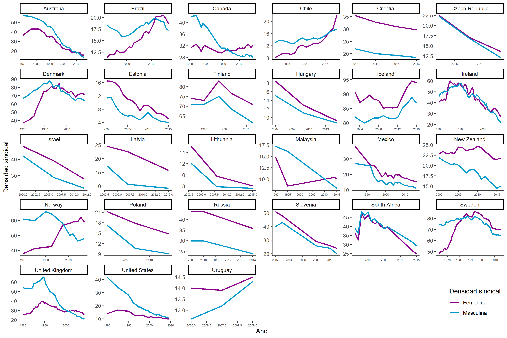
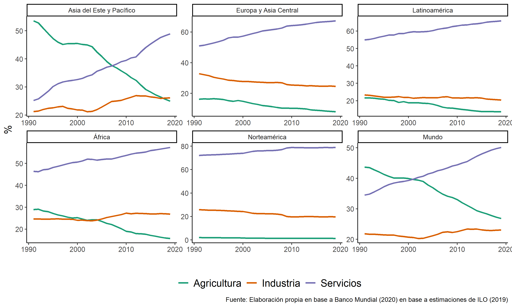

```{r set up2, echo= F, message=FALSE,warning=F}
#1. Packages
pacman::p_load(dplyr, ggplot2,
               ggsci, tidyr, WDI, plotly,
               RColorBrewer, htmlwidgets,
               kableExtra, withr)

#0. Theme
theme_set(theme_classic() + theme(axis.title =  element_text(size = 14),
                                  axis.text = element_text(size =10),
                                  legend.text = element_text(size =14)))

options(kableExtra.html.bsTable = T)
options(knitr.kable.NA = '')
#2. Cargar bases de datos
load(file = "../output/data/db-proc.RData")
```

# ¿Por qué ellas hoy son más y ellos menos?: hacia un marco analítico de la densidad sindical por sexo 

*“Working women needs unions, and unions needs working women: today, union labor force is union working women”*

Desde finales de 1980 la reestructuración productiva, desregulación de los mercados de trabajo, la internacionalización y los altos niveles de desempleo tuvieron profundas implicancias en la participación laboral y sindical de las mujeres. A la luz de estos fenómenos se produjo un evidente crecimiento de las mujeres en el mercado de trabajo, especialmente con una importante participación en el sector servicios y el empleo a tiempo parcial. Ahora bien, gran parte de la literatura ha puesto atención a los factores antes mencionados como erosionadores del sindicalismo, pasando por alto que estos cambios coinciden con la creciente importancia que han ganado a nivel mundial las mujeres en los sindicatos: hoy más que nunca hay más mujeres en los sindicatos, y la diferencia de sindicalización entre hombres y mujeres ha desaparecido en gran parte de los países del mundo. 

Este capítulo buscará llenar ese vacío examinando el impacto de estos determinantes- la reestructuración productiva, los ciclos económicos y los cambios institucionales en las relaciones industriales- sobre el mercado laboral y los sindicatos, pero poniendo especial énfasis a porqué esto podría haber afectado a las mujeres trabajadoras y su relación con los sindicatos. La tesis central que se busca defender, ante la evidente convergencia hacia la feminización de la sindicalización, ya ha sido anunciada: las mujeres trabajadoras necesitan a los sindicatos y los sindicatos necesitan a las mujeres trabajadoras. Hoy, la fuerza laboral del sindicalismo es la mujer sindicalista.   En otras palabras, lo que ha traído a las mujeres a la organización sindical tiene que ver más con la ubicación que la mujer han empezado a ocupar en el mercado laboral (i.e su predominancia en el sector servicios y en empleos flexibles) y en como el sindicalismo les sirve como motor para canalizar sus demandas; como también ocurre que los sindicatos han necesitado de esta nueva fuerza de trabajo para mantenerse vivos. 

En consecuencia, la estructura argumentativa de la tesis retoma estos elementos a partir de un análisis empírico y teórico de: (1) cómo se evidencian los cambios y diferencias de densidad sindical entre los países a partir de 1960 a la actualidad, como una forma de contextualización general de los cambios recientes en el capitalismo y los sindicatos; (2) se plantean factores como los ciclos económicos, en parte pues estos han permitido explicar los crecimientos sindicales; (3) se abordan determinantes como los cambios en la estructura productiva y composición de la fuerza de trabajo debido a que no solo son factores que abordaron el declive sindical sino que también son la base para entender como se altera el ambiente para la organización de las mujeres en el trabajo; (4) se puntualizan cómo los cambios en la densidades sindicales presentan divergencias en la última década, explicado a partir de las diferencias institucionales en los países. Abordar estas relaciones, sobre todo a razón de cómo ha afectado a la densidad sindical femenina, es esencial en tanto estas teorías si bien han sido limitadas en explicar la sindicalización de las mujeres, si han tenido respuestas satisfactorias al entendimiento de los patrones de densidad sindical al menos de los países centrales. Como consecuencia de ello, el capítulo cierra indicando esta ausencia en el análisis de la densidad sindical por sexo, mostrando algunos estudios empíricos que han sido la excepción a la regla. A partir de esta discusión, se propone un marco analítico para la densidad sindical por sexo proponiendo hipótesis de porqué la feminización de la sindicalización ha emergido en algunos países y en otros no.


## Una perspectiva histórica y comparada de la densidad sindical en el mundo

Entre los distintos países del mundo los porcentajes de trabajadores que forman parte de una organización sindical presentan diferencias abismales (ver Figura \@ref(fig:fig2-1)). Así mismo, esta densidad sindical, en un mismo país, contrasta notablemente entre los periodos de su historia. 

```{r fig2-1, results='asis', echo= F,  fig.cap="(ref:fig2-1)"}
g <- db %>% filter(!is.na(UD), ocde =="OCDE") %>% group_by(country) %>% filter(year == max(year)) %>% 
  mutate(n_ud = ifelse(UD <=30, "Bajo","Alto")) %>% 
  ggplot(aes(x= reorder(country, UD), y = UD, fill =UD,
             text = paste("País:", country, "</br>Año:", year))) + 
  geom_bar(stat="identity", color = "black") + scale_fill_viridis_c(name = "") + geom_hline(aes(yintercept = 35.6), linetype = "dashed", color = "gray40") + 
  scale_y_continuous(labels = function(x) paste0(x, "%")) + 
  labs(x= "", y = "Densidad sindical", caption = "Fuente: Elaboración propia en base a ICTWSS (2019), con UD último año. Linea indica promedio") + theme(legend.position ="none",axis.text.x= element_text(angle = 40))

subplot(
  with_options(list(digits = 2), ggplotly(g, tooltip = c("text", "y"), titleX = T)))
```

(ref:fig2-1) Densidad sindical en países OCDE para último año (2016). Fuente: Elaboración propia en base a ICTWSS (2019) con el último año de densidad sindical registrado para cada país.

La literatura sobre la densidad sindical ha observado tres grandes movimientos históricos del fenómeno. El primero es un periodo de auge de la sindicalización, que tiene sus orígenes en los finales de la Gran Guerra y, su apogeo y crisis, a inicios de los años setenta, con la crisis del petróleo, el fin de la convertibilidad del oro y las movilizaciones obreras y estudiantiles del 68’ [@silver2003; @traxler2001; Tronti, 2001]. Las bases de este crecimiento sindical se encuentran en los grandes compromisos de clase a nivel institucional que sostuvieron los sectores organizados de las clases medias y obreras, con representantes del capital y gobiernos de corte socialdemócrata [@korpi2018]. Esto, en el marco de un desempeño económico virtuoso que permitía conciliar crecientes demandas salariales y transferencias en servicios sociales con óptimas tasas de acumulación e inversión . Es durante este periodo que historiadores y economistas buscaron explicar este crecimiento sindical, principalmente poniendo el foco en macro determinantes como los ciclos económicos, tales como la inflación y el desempleo.

El segundo es un periodo de drástica caída de la sindicalización [@western1995] y de la actividad huelguística [@shalev1992], cuyas raíces han sido identificadas en los procesos de globalización [@wallerstein2000] y reestructuración de los procesos productivos [@jenkins1997], que producirán cambios y presiones sin precedentes sobre la organización del trabajo durante los años ochenta y noventa. Los modelos que emergen este periodo se centrarán en estudiar las determinantes a nivel estructural de la densidad sindical, ya sea en factores como la estructura productiva o en la composición del empleo.

Por último, desde los años dos mil se identifican grandes divergencias entre y dentro de los países [@visser2019], lo que lleva a observar dispares procesos de organización y movilización entre sectores de la clase trabajadora. Así, conviven teorías que insisten en evidenciar una convergencia hacia un declive sindical producto de la neoliberalización económica [@baccaro2011], mientras que otras identifican resultados distintos como procesos de revitalización sindical [@frege2004] y asensos de la conflictividad laboral en industrias y regiones particulares del sistema mundo [@silver2003]. Siguiendo y ampliando este argumento, esta investigación sostiene que es discutible si existe o no una convergencia hacia la feminización de la sindicalización: mientras la densidad sindical de los hombres se encuentra estancada o en franca retirada, la feminización sindical toma protagonismo e invita a una relectura de aquello que parecía finalizado.  


```{r fig2-2, results='asis', echo= F, warning = F, message=F, fig.cap="(ref:fig2-2)"}
g  <- db %>% dplyr::select(UD, year, country, continent) %>% filter(!is.na(UD), continent  !="África") %>% 
  ggplot(aes( x= year, y=  UD, color = country))  + geom_line() +
  scale_y_continuous(labels = function(x) paste0(x, "%")) + 
  facet_wrap(.~continent) +
  theme(legend.position='none') +  
  labs(y =" Densidad sindical", x ="", caption= "Fuente: Elaboración propia en base a ICTWSS (2019)(*)")

p <- ggplotly(g) 
p
```

(ref:fig2-2) Densidades sindicales por continente (1960-2020). Fuente: Elaboración propia en base a ICTWSS (2019)

En la Figura \@ref(fig:fig2-2) se pueden observar los tres periodos mencionados de aumento, crisis y divergencia en los países centrales, como los son los de Europa Occidental y Estados Unidos. Entre 1960 a 1980, a excepción de los Países Bajos y Francia, gran parte de Europa presenta un aumento en su densidad sindical. La misma tendencia se puede identificar en países de otros continentes como Canadá y Nueva Zelanda. A finales de 1980, con la introducción del neoliberalismo e internacionalización de las relaciones laborales, la tasa de sindicalización declinó sin discriminación en los países: en los cuatro países nórdicos (Suecia, Noruega, Finlandia y Dinamarca) esta disminuyó de un 90% a 68%; en Europa continental del Oeste (Austria, Bélgica, Francia, Alemania, Italia, Países Bajos, Portugal, España y Suecia) de 43% a 24% [@visser2019]. Un ejemplo muy claro es Nueva Zelanda: en inicio de la década de 1960 el país bordeaba una sindicalización de un 45,8%, a 1980 llega a 69%, y en menos de 10 años el país pierde en densidad sindical todo lo que había ganado en los años precedentes. Evidentemente este análisis no es igual al introducir naciones pertenecientes a continentes como Sudáfrica, Asia, América Latina y Europa del Este. La periodización clásica se torna confusa y los tres grandes movimientos de la densidad sindical dejan de ser claros. Por un lado, podremos notar que en Asia las trayectorias son disímiles en el sentido que, si bien Rusia e Israel siguen la tendencia de Europa Central, países como China viven un auge en la sindicalización durante los 80 y luego de la crisis del 2008. Por otro, países latinoamericanos como Chile y Argentina muestran un auge en la sindicalización al menos hasta los 80 – hasta el 73 en el caso chileno -, pero luego se suman a la tendencia de declive generalizado que se vive en países como México, Brasil y Estados Unidos .  

Pero *¿qué ocurre específicamente con la sindicalización femenina?* Conocidos son los estudios que sugieren que las mujeres tienen aversión a los sindicatos debido a que, por un lado, estos son incapaces de promover sus “intereses de género” [@greene2006;@sinclair1995; @walters2002], y por otro, las mujeres tendrían actitudes menos militantes y de confrontación que hombres, por lo que el sindicalismo no sería un espacio para ellas [@tomlinson2005]. Las causas estén o en la organización sindical o en las actitudes de las mujeres, lo cierto es que las investigaciones han consensuado que la menor participación de las mujeres en los sindicatos está atravesada también por el declive del sindicalismo. 

Sorprendentemente es una tendencia que se ha revertido. A partir de los años 2000 nuevas oportunidades han comenzado a emerger en la organización de los trabajadores: en diversos países no solo hay más mujeres en los sindicatos, sino que también la sindicalización femenina ha ido superando a la masculina - lo que llamaremos feminización del sindicalismo.  Efectivamente en la mayoría de los países los hombres tienen en términos absolutos una mayor participación en los sindicatos [@schnabel2013; @visser2015] pero esto se produce en la medida en que su participación en la fuerza de trabajo es mayor. 

Sin embargo, como anunciábamos al inicio de esta investigación, si controlamos por la participación en el mercado laboral, se puede notar con creces que a nivel mundial las mujeres han aumentado su densidad sindical. De los 25 países en las gráficas, en 14 de ellos se ha feminizado el conflicto laboral (Figura \@ref(fig:fig2-3)): Australia, Canadá, Chile, Dinamarca, Estonia, Finlandia, Islandia, México, Nueva Zelanda, Noruega, Rusia, Suecia y el Reino Unido. Mientras que en los países restantes se puede evidenciar que si bien la densidad sindical femenina no ha superado a la masculina han disminuido notablemente las brechas de sindicalización por género -como en Estados Unidos- y/o la sindicalización masculina ha ido disminuyendo. El rápido avance de la feminización del sindicalismo, combinado con la caída de la sindicalización masculina, es probablemente la "mayor y más profunda transformación en el sindicalismo" [@visser2006, pp.47].

```{r fig2-3, results='asis', echo= F,  fig.cap="(ref:fig2-3)"}

```

(ref:fig2-3) Evolución de la densidad sindical por sexo, países feminizado. Fuente: Elaboración propia en base a encuestas de hogares e ICTWSS -@visser2019

```{r fig2-4, results='asis', echo= F,  fig.cap="(ref:fig2-4)"}
knitr::include_graphics("figures/figura1.2.png")
```

(ref:fig2-4) Evolución de la densidad sindical por sexo, países feminizado. Fuente: Elaboración propia en base a encuestas de hogares e ICTWSS -@visser2019

Incluso, en alguno de los países donde se ha feminizado la densidad sindical -la participación de las mujeres en el sindicalismo, en relación con su participación en la fuerza de trabajo- también se ha feminizado la proporción sindical -la participación de las mujeres en los sindicatos, en relación con el total de sindicalizados. 

```{r fig2-5, results='asis', echo= F,  fig.cap="(ref:fig2-5)"}
knitr::include_graphics("figures/figura2.5.png")
```

(ref:fig2-5) Proporción de mujeres y hombres en los sindicatos, 2011. Fuente: Elaboración propia en base a replicación de  @ilo2011

La feminización del conflicto laboral es una profunda transformación que, como muestran las cifras, parece no referir a una variación particular de un país: si Suecia de 1983 inauguró el fenómeno, la mayoría de los países evidencian este cambio en los años 2000, coincidentemente cuando se comenzaron a sentir los efectos de la desindustrialización. Así también, dista de ser una alteración con pronto retorno pues las cifras muestran que la tendencia o se ha estabilizado -como el Reino Unido y Suecia- o incluso aumentado la brecha de sindicalización por género, a favor de las mujeres -como en Chile. Ahora bien, *¿cómo se pueden explicar estos patrones de densidad sindical por sexo?*

## Determinantes cíclicos del crecimiento sindical: un análisis del empleo y los salarios

*“In general, workers are more likely to support unionization when the union organizer can promise a high wage and a small employment loss.”* [@borjas2016]


Los primeros estudios sobre los factores que indicen en la densidad sindical partieron de la mano con Commons et al @commons1918 y @perlman1928 quienes desde una perspectiva histórica analizaron la emergencia y dinámica de los sindicatos, en relación con las condiciones económico-sociales que se estaban produciendo a finales del siglo XIX. A partir de ese mismo interés, pero con más precisión, desde la mitad de siglo XX el funcionalismo se preguntó por las causas del crecimiento de la densidad sindical [@dunlop1948; @shister1953], especialmente poniendo énfasis a los efectos económicos que la Gran Depresión [cf. @davis1941] , la Gran Guerra [cf. @olson1965] y el New Deal [cf. @bernstein1954] podrían tener en la razón que tendrían los trabajadores para sindicalizarse. En consecuencia, en la época emerge un gran paradigma que analiza las causas de la densidad sindical a partir de nociones del “rational choice”. Estos enfoques se formalizan en teorías de la demanda y oferta por sindicalización, donde la demanda supone que los trabajadores buscan maximizar utilidades y en donde el sindicalismo provee de beneficios y sanciones (incentivos) para la organización. A partir de ahí emergen dos grandes hipótesis: por un lado, las teorías de conciencia en el trabajo plantearán que la densidad sindical crece debido a las malas condiciones de empleo [@perlman1928]; mientras que, las teorías del control laboral proponen que, en tiempos de auge, la sindicalización aumentará si los sindicatos controlan los despidos y contrataciones [@olson1965]. 

Las teorías que tomaron la delantera son las últimas, y que con el aumento de la inflación durante los 70, comenzaron a mostrar más evidencia de la existencia de un carácter próciclico entre la densidad sindical y los ciclos económicos, es decir, a tiempos de auge más sindicalización. 


```{r fig2-6, results='asis', echo= F,  fig.cap="(ref:fig2-6)"}
knitr::include_graphics(c("figures/figura2.6.png", "figures/figura2.6(2).png"))
```

(ref:fig2-6) Series de tiempo de densidad sindical y tasa de empleo según continente (1960-2020). Fuente: Elaboracion propia en base a ICTWSS-@visser2019 y OCDE -@oecd2020

De manera descriptiva, la Figura \@ref(fig:fig2-6) reporta evidencia del carácter procíclico de la densidad sindical, esto es, en momentos de prosperidad y crecimiento del empleo la masa de sindicalizados aumenta. Es decir, contrario a las teorías que plantean que en momentos de mayor deprivación económica los trabajadores propondrían a organizarse sindicalmente,  existen algunas pautas consistentes que indican que el crecimiento de la densidad sindical es próciclico [@calmfors2001, pp.19; @riley1997]. En gran parte de los continentes del globo la tasa de sindicalización y empleo siguen la misma tendencia de variación, a excepción de Latinoamérica que presenta una evidente densidad sindical contracíclica.

En estos modelos de demanda y oferta por densidad sindical, las variables del ciclo económico consideradas fueron los **salarios reales**, **inflación**, **crecimiento del empleo** y **nivel de desempleo**. Las variables del ciclo económico consideradas por la literatura de este periodo son principalmente salarios reales, inflación, crecimiento del empleo y nivel de desempleo. @bain1976 muestran para Suecia, Estados Unidos, Australia y el Reino Unido evidencia de una relación positiva entre salarios reales y densidad sindical, lo que ha sido interpretado como producto del llamado “efecto de crédito”, es decir, que un alza en los salarios puede hacer que los trabajadores se sindicalicen si imputan tales ascensos a la acción de los sindicatos y esperan que apoyándolos les vaya aún mejor en el futuro. A su vez, la inflación ha sido incorporada por su “efecto amenaza”, es decir, pueden hacer que los trabajadores se sindicalicen cuando los precios suben para defender su nivel de vida [@ashenfelter1969; @bain1976]. A su vez, ambos autores muestran una relación positiva con el cambio en el empleo, interpretada como un aumento en la fuerza de trabajo disponible para la actividad sindical y una disminución de la amenaza de sustitución ante la presencia de mercados laborales más expandidos (o en palabras de @wright2000, un aumento en el poder estructural de mercado). En relación al punto del desempleo, @bain1976 muestran que hay una relación negativa entre la desocupación y la densidad sindical, lo que los autores traducen en que mayores niveles de desempleo puede influir en la pérdida de poder  de negociación de los trabajadores frente a los empleadores (por las razones indicadas previamente), haciendo menos atractivo el sindicato. En contraste a esta evidencia próciclica, se reportan dos tendencias contrariadictorias: la primera con el desempleo,  pues un crecimiento de este puede implicar también un aumento del descontento de los trabajadores llevándolos a unirse más a sindicatos [@ashenfelter1969, pp. 437]; la segunda, se prueba la hipótesis del “efecto de saturación” donde a medida que mayor sea la proporción sindicalizados, más difícil será aumentar la afiliación sindical, pero también se produce el “efecto aplicación” donde a mayor densidad sindical previa, los sindicatos se ven con más capacidad de persuasión [@bain1976].

Como se puede notar, uno de los principales problemas está en que los modelos cíclicos principalmente interpretaron sus resultados en términos de la decisión individual de los trabajadores (Schnabel, 2013a), tratando de formalizar las hipótesis de sus modelos con un correlato con la demanda por sindicalización, donde los individuos decidirían en base a beneficios y costos que estos interpretarían en base a la performance macroeconómica. En consecuencia, los cambios en la afiliación sindical habrían sido analizados más como cambios en la propensión a la sindicalización de los individuos que como cambios en la densidad sindical de los países. En esa línea, @visser1990 indica que el interpretar el crecimiento de los sindicatos como la agregación de la decisión individual de los trabajadores, el papel de agentes macroeconómicos como los grupos empresariales, los sindicatos y el Estado pueden ser subestimados. También, @schnabel2002  indica que estos modelos no pueden explicar las diferencias de densidad sindical entre los países, tanto en los distintos niveles como en su transformación, en parte porque no consideran  explicaciones estructurales e institucionales de los países para identificar sus diferencias [cf.@freemand1990; @disney1990; @stepina1986; @armingeon1989; @schnabel1989]. 

Si bien estos enfoques tuvieron un importante potencial explicando el auge sindical, fueron profundamente ciegos al género. Los estudios de la época indicaron una relación negativa entre el sexo y la densidad sindical, principalmente centrado en que las mujeres eran una fuerza de trabajo temporal o que representaban el segundo ingreso de sus hogares [@kornhauser1961;@moore1975, pp. 436]. Solo @scoville1971, @kessler-harris1975, y más tarde, @sutton1980 rechazan estás hipótesis mostrando evidencia que si bien en términos agregados las mujeres tienen menos membresía sindical, si se considera la participación en la fuerza de trabajo tienen la mismas probabilidades que los hombres. Ahora bien, es posible notar que no existe una respuesta en los mismos términos que la densidad sindical general (i.e considerando variables como salarios o desempleo) al porqué la densidad sindical de mujeres es más baja que la de hombres para la época, y solo se propone por parte @sutton1980 que esto es producto de factores institucionales discriminatorios. 
Solo con el auge de la sindicalización femenina a finales de 1980, aparecen investigaciones que muestran evidencia sobre la relación cíclica entre la tasa de empleo y sindicalización femenina [@boston2015]. Con las crisis económicas ocurridas durante los 80, una forma de mitigar la pobreza producida en los hogares por la disminución de salarios reales y aumento el desempleo masculino, según @killingsworth1986 señalan que las mujeres aumentaron su participación en el empleo sustituyendo el trabajo doméstico por el trabajo en el mercado. Debido a esto, las mujeres aumentaron su potencial de sindicalización pues no son una fuerza de trabajo transitoria @humphries1988 .De hecho,  @milner2017 indica indirectamente que con la crisis financiera del 2008 esta hipótesis se intensificaría: hasta entonces se había creído que la mujer servía como ejército de reserva durante las crisis - tal como ocurrió en la Segunda Guerra Mundial- , y en consecuencia no sería fuerza de trabajo durable y menos aun afiliable al sindicalismo (p.192). Pero más bien lo que pasó durante la crisis del 2008 es que, por un lado, las mujeres a largo plazo aumentaron su participación en el empleo a través de trabajos con menores salarios y más flexibles [@karamessini2013; @humphries2010] – como modo de amortiguar la crisis -, y por otro, aumentaron también su participación en el sindicalismo. No existe evidencia sobre porqué esto produciría más afiliación, controlando por el aumento de la participación laboral femenina. Ahora bien, a razón de que se involucran a más mujeres durante las crisis para reducir costos laborales, es posible que esto se exprese en reducciones salariales y deregulación de jornadas, y con ello de igual manera desagravios entre las asalariadas [@cox2007, pp. 719]. En consecuencia, la presente hipótesis contiene elementos procíclicos y de las teorías de la conciencia del trabajo para las teorías de densidad sindical generales:

$H_{1}$: A corto plazo se espera que, en periodos de alto aumento del desempleo, el desempleo masculino va a aumentar y el de mujeres disminuir. Las mujeres aumentarán su sindicalización debido a que el aumento de su empleabilidad estará asociada a puestos precarios y con brechas salariales altas, lo que las llevará a sindicalizarse como un modo de resguardar sus condiciones laborales. En consecuencia, aumento en el desempleo femenino feminiza la densidad sindical debido a la inclusión de más mujeres en los sindicatos, pero también al escape de los hombres de estas por el aumento de su desempleo.

## Determinantes estructurales del declive sindical: el efecto de la globalización y desindustrialización

A partir de 1980 la densidad sindical sufre un quiebre con su tendencia al alza de los años anteriores, sobre todo, debido a los procesos de desindustrialización y cambio tecnológico, que producen una reorganización de la producción [@jenkins1997] y circulación del capital [@streeck2010b], lo que tuvo como consecuencia la erosión de las bases tradicionales del movimiento obrero [@silver2003]. Desde estos años la estructura económica y la composición de la fuerza de trabajo va a transitar desde una estructura productiva industrial principalmente dominada por hombres, hacia una de servicios en donde las mujeres comienzan a tener un mayor protagonismo en la fuerza de trabajo. 
En la figura \@ref(fig:fig2-7). se puede observar el cambio, a nivel mundial, en las estructuras económicas de los países, resaltando el crecimiento del sector servicios en todas las regiones, llegando a más del 50% de los ocupados; la desindustrialización progresiva de Europa y Asia del Este desde los años noventa; la industrialización de Asia del Este y Pacífico, y África, después de los años dos mil; y la baja generalizada del sector de la agricultura. En solo 20 años el sector servicios creció cerca de un 15% tanto en países OCDE como en economías en vías de desarrollo [@worldbank2020]

```{r fig2-7, results='asis', echo= F,  fig.cap="(ref:fig2-7)"}

#Figura 2.7 Series de tiempo de densidad sindical y tasa de empleo según continente (1960-2020)
#Fuente elaboracion propia en base a ICTWSS y OCDE
```

(ref:fig2-7) Empleo según sector económico por continente (1990-2019). Fuente: Elaboración propia en base a Banco Mundial -@worldbank2020 y estimaciones de ILO -@ilo2019


```{r fig2-8, results='asis', echo= F,  fig.cap="(ref:fig2-8)"}
knitr::include_graphics(c("figures/figura2.8.png", "figures/figura2.8(2).png"))
```

(ref:fig2-8) Participación en el trabajo asalariado y empleo parcial según sexo a nivel mundial (1960-2020). Fuente: Elaboración propia en base a @oecd2020


Como se puede evidenciar en la Figura \@ref(fig:fig2-8), entre 1960 a 1980, las cifras indican que el ingreso importante de las mujeres a la fuerza, que, si bien en los años venideros fluctúa considerablemente, ya en 1980 se ve una constante creciente. Ahora bien, esta tendencia estructural de cambio evidencia diferencias importantes en el globo: entre 1980 a 2010 se dio un aumento en promedio de 54% a 71% de participación femenina en el empleo, mientras que en América Latina la variación se dio desde 41,2% a 49,9%. [cf.@goldin2016; @ilo2010, pp. 29]. Ya para el 2000 un 85,1% de las mujeres ocupadas estaban concentradas en el sector servicios [@ilo2004]. Las ocupaciones desarrolladas en el sector financiero, comunicaciones, salud, servicios sociales y comunitarios y administración pública se fueron feminizado mientras que las mujeres se fueron subrepresentando en el sector industrial [@galvez2001, pp. 66]. Con esto se quiere indicar que las mujeres tienen un patrón diferenciado de ingreso al mercado laboral, donde si bien la participación laboral femenina ha aumentado, en general el acceso ha sido limitado tipo de trabajos que se concentran en el sector servicios, en empleos de bajos salarios y con jornadas flexibles sin seguridad social malas condiciones de trabajo y ausencia de protección social. De hecho tal como nos muestra la Figura \@ref(fig:fig2-8) el trabajo part time sigue siendo más prevalente en mujeres que en hombres a nivel mundial (Fagan et al., 2015). El informe de Panorama Laboral [@ilo2018] de la OIT muestra que 68 de los 73 países estudiados presentan una feminización del trabajo part time, junto con que el 14% de las mujeres empleadas son a tiempo parcial, mientras que los hombres solo un 7%. Así también, menos de la mitad de las mujeres tienen algún empleo a tiempo completo, mientras que más de un 75% de los hombres empleados trabajan a tiempo completo.

Con estos cambios antes indicados, la literatura de densidad sindical cambió su enfoque. Básicamente, los estudios se centraron apuntar cómo estos cambios en la composición y condiciones del empleo erosionarían al sindicalismo, particularmente fundamentado en cómo, por ejemplo, las mujeres y los trabajadores a tiempo parcial tendrían menos propensión a sindicalizarse [@ebbinghaus2011]. Bajo este esquema, una serie de estudios se centraron en analizar las causas del declive sindical en los distintos países [@wallerstein2000], bajo un enfoque de determinantes estructurales de la sindicalización [@schnabel2002; @ebbinghaus1999]. La literatura estuvo centrada principalmente en factores medidos transversalmente y que se reducen a características sociales de quienes participaban en sindicatos y quienes no (eg. edad, sexo, raza y educación), y por ello, más que modelos de densidad sindical referencian a modelos individuales de propensión u oportunidad de membresía sindical [cf. @scoville1971; @bain1985; @groot1994; @fitzenberger1999). Sin embargo, un número no menor de estudios estudiaron de manera agregada los cambios en la estructura productiva (véase Figur \@ref(fig:fig2-7)) y en la composición del empleo (véase Figura \@ref(fig:fig2-8)) principalmente a través de variables asociadas a la tercerización y feminización, indicando que estas producirían una merma en el poder de los trabajadores. 

En primer lugar, según @polachek2004 el declive sindical está influenciado por tendencias de cambio en la estructura industrial. Una serie de investigaciones apoyan esta proposición indicando que, si la proporción del sector económico de servicios aumenta en desmedro del manufacturero, la densidad sindical va a disminuir [@blaschke2000; @lee2005; @polachek2004; @carruth1990 para Alemania ; @farber2001, para Estados Unidos]. Si bien se ha indicado que esta variable no es significativa [@brady2007; @blanchflower2009; @charlwood2008; @fitzenberger2011; @vachon2016] con técnicas más avanzadas se comprueba que el crecimiento del sector servicios tendría un efecto negativo sobre la densidad sindical bajo el argumento de que en el sector terciario los sindicatos tienen más dificultades para reclutar socios por las condiciones flexibles de trabajo a las que se enfrenta [@traxler1999; @wrigley2010]. Del mismo modo,  el aumento de la proporción de empleados en el sector público ha sido interpretado como un factor que aumenta la densidad sindical, bajo el entendido de que los costos de sindicalización para empleados (como despidos y represalias) son menores en este sector (Schnabel, 2003), y por lo mismo la densidad sindical es más alta en este sector @ebbinghaus2000. De hecho, @kirmanoglu2012 muestran evidencia para 24 países donde si el empleo público aumenta en el tiempo, la densidad sindical también aumentará[^1]. 

En segundo lugar, si crecen los grupos que se espera que tengan menor adhesión a la fuerza de trabajo– y por tanto sean más difíciles de organizar [@ebbinghaus2011; @schnabel2007; @visser2006]- , es probable que la densidad sindical descienda. Otro argumento desarrollado indica que si los grupos menos “militantes” con el sindicalismo crecen, esto es grupos que no pertenecen a la base obrera tradicional como las mujeres, el sindicalismo irá en declive [@sinclair1995; @tomlinson2005).  Los estudios más recientes apuntan a como el aumento de las mujeres,  proporción de extranjeros y empleados atipícos como los trabajadores a tiempo parcial e informales disminuyen la densidad sindical [@visser2012; @ebbinghaus2011; @schnabel2007; @visser2006]. 

Empero, las explicaciones estructurales hasta aquí expuestas nuevamente ponen el foco en razones individuales (eg. grupos con menor disposición militante a la sindicalización) para explicar el declive de la sindicalización a nivel agregado. El problema no es puramente formal: gran parte de los estudios de densidad sindical indican una relación negativa con el ser mujer, y con ello el aumento de la membresía sindical -controlando por su mayor participación en el mercado- no podría ser entendida. Esta misma limitante ocurre en otros contextos donde no necesariamente los cambios en la estructura económica y la composición de la fuerza de trabajo produjeron un impedimento a la organización sindical [@schnabel2013], incluso apareciendo nuevas tendencias donde no declina la sindicalización sino que emerge la “tercerización del conflicto laboral” [@kocsis2013].

En cierto sentido los estudios de @haile2016 para Inglaterra son  de los pocos de este tipo que nos permitirían entender porque la sindicalización se feminiza. Desde 1980, la fuerza de trabajo femenina ha aumentado notablemente de la mano con la expansión del sector servicios, cambiando significativamente la composición de género de sectores. La literatura plantea que esto puede producir que la estructura sindical, con la incorporación de mujeres, se va a ver enfrentada a un antagonismo con la estructura tradicional sindical dominada por los hombres, y por ello podría ocurrir también un “escape” de los miembros masculinos [@haile2017]. En la suma y resta esto podría producir la feminización de la densidad sindical pues si más mujeres entraran a la estructura sindical robustecida por mujeres, más hombres se irán de la organización al verse menos representado en estas organizaciones. 

Una forma de aproximarnos a nivel de los países a este fenómeno es viendo el efecto que tiene el crecimiento de sectores que están feminizados, como el sector servicios; o el crecimiento de empleos feminizados, como el empleo partime. En consecuencia, se explora si el crecimiento de variables asociadas al empleo pink collar (i.e mujeres trabajadoras de los sectores servicios, de empleos flexibles y con bajos salarios) producen una mayor feminización de la densidad sindical.  Esta hipótesis exploratoria es plausible sobre todo a la luz de la convergencia entre: (1) la tendencia hacia la feminización del empleo remunerado ha ido al alza, (2) el sector servicios  y empleo par time^3 [^2]  ha ido en expansión -siendo este la principal inserción de las mujeres, (3) la “tercerización de los conflictos laborales” (Kocsis et al., 2013) y (4) feminización densidad sindical, lo que para @artus2015 es como sumar uno más uno plantear alguna hipótesis sobre la relación entre la feminización de los conflictos laborales y estas tres tendencias (p.93)

$H_{2}$: Con el crecimiento de los sectores económicos feminizados, como el sector servicios, a largo plazo se producirá un cambio en la estructura sindical que por un lado se va a producir un aumento de la densidad sindical femenina y por otro un escape de la membresía masculina. En suma y resta, la sindicalización se feminizará.

## Determinantes institucionales de la densidad sindical 

Si bien los últimos 20 años la densidad sindical ha disminuido en 38 de los 53 países a analizar (Tabla 2.1 ); en 12 naciones la sindicalización ha aumentado o se ha mantenido igual en los últimos años. De hecho, en tendencias a largo plazo solo 5 en cada 9 países han disminuido su densidad sindical (1960 a 2019). Con esto, la evidencia es clara en que desde los años 2000 existe una divergencia de trayectorias sindicales entre los países. Mientras en algunos países la densidad sindical mantiene su declive, en otros se estanca y, en otros, sorpresivamente aumenta (Figura \@ref(fig:fig2-2)). A su vez, no solo se han diferenciado diferencias temporales (Figura \@ref(fig:fig2-1)). Investigaciones recientes han constatado patrones diferenciados en la densidad sindical entre países anglosajones y del Europa Occidental [@schmitt2012;@visser2006; @scruggs2002;@checchi2002]: por un lado, podemos encontrar países con densidades sindicales bajo un 12% (Francia, Corea del Sur, Estados Unidos) mientras que encontramos países con afiliación sindical por sobre un 60% (Finlandia, Suecia, Dinamarca, etc)

```{r tab2-1, results='asis', echo= F,  tab.cap="(ref:tab2-1)", message= F, warning= F}
table <- db %>% group_by(country, year) %>% 
  do(add_row(., country = unique(.$country),
             year = unique(.$year),
             growth_ud = mean(.$growth_ud, na.rm = T))) %>%
  mutate(growth = ifelse(growth_ud < 0, "Decenso","Aumento")) %>% dplyr::select(country, growth_ud, growth) %>% filter(!is.na(growth_ud), !is.na(growth)) %>%  unique()
table1 <- table %>% 
  mutate(periodo=case_when(year %in% c(1961:1979)~1,
                           year %in% c(1980:1999)~2,
                           year %in% c(2000:2020)~3)) %>% 
  group_by(periodo,country) %>% summarise(growth_ud=mean(growth_ud,na.rm = TRUE)) %>% 
  spread(periodo,growth_ud)
## Ops
options(kableExtra.html.bsTable = T)
options(knitr.kable.NA = '')

knitr::kable(table1, digits = 3,  booktabs = T,
                      col.names = c("País", "60-70", "80-90", "2000-hoy"), caption= "Variación de la densidad sindical en países de estudio (1960 a 2018)") %>%
  add_header_above(c(" ", "Décadas" = 3)) %>% 
  kableExtra::kable_styling(latex_options = "hold_position")%>%
  kableExtra::kable_styling(bootstrap_options = c("striped", "hover", "condensed", "responsive"), full_width = F)%>%
  kableExtra::column_spec(1, width = "9cm") %>%
  kableExtra::footnote(general = "Fuente: Elaboración propia en base a ICTWSS (2019)", general_title = "") %>%
  kableExtra::scroll_box(width = "500px", height = "600px")

```


Una de las dificultades que implícitamente se ha abordado hasta ahora es que los análisis de series temporales y comparados han tenido poca capacidad de integración. @schnabel2013 puntualiza que este problema ha sido abordado considerando factores institucionales en el análisis, factores tales como contexto de las relaciones industriales, la legislación laboral y las orientaciones sociopolíticas de los gobiernos. De este modo, los estudios que abordan los determinantes de los cambios en la densidad sindical han apuntado a los marcos institucionales de los países para poder entender sus dinámicas y diferencias. 
En primer lugar, @checchi2005 y @visser2006 indican que, si bien el desempleo tiene un efecto negativo sobre la densidad sindical en el corto y largo plazo, esa relación puede ser puesta en duda en los países en donde se provee de seguridad al desempleo [@brady2007; @blanchflower2009; @charlwood2008;@fitzenberger2011]. De hecho, @ebbinghaus2011 en un estudio multinivel apuntan a que los sistemas Ghent explican por qué la densidad sindical crece a pesar de que los niveles de desempleo pueden ser mayores, comprobando lo que previamente ya @olson1965 había hipotetizado con su teoría del control del trabajo. El argumento principal está en que en países donde el desempleo está protegido por políticas sindicales, las personas buscarán sindicalizarse de modo de resguardarse ante posibles periodos de receso económico [@ebbinghaus1999; @olson1965; @rothstein1992; @western1997], mientras que en países donde ese tipo de protecciones no existe o no son controladas sindicalmente, el desempleo sigue su impacto ya reseñado. De manera similar, @scruggs2002 encuentran evidencia de que las estructuras centralizadas de negociación colectiva producen una mayor sindicalización en escenarios donde los salarios reales disminuyen, como una forma de resolver el conflicto salarial entre capital y trabajo.

Un tercer punto analizado y más controversial tiene que ver con la globalización: la apertura del comercio, mayor movilidad de flujos de capital y el aumento de inversión extranjera han sido interpretadas como factores que socavan la densidad sindical [@golden1995; @ebbinghaus2000]. @wallerstein2000 indicaron que un aumento en la globalización, medido en aumento de importaciones, disminuye la densidad sindical debido a que la globalización empuja a las economías nacionales a “una carrera hacia el abismo” [@silver2003] produciendo efectos negativos sobre las condiciones de los trabajadores [@stiglitz2002; @rodrik2011] y haciendo más difícil su organización. La competencia entre las nacionales llevó a implementar formas de trabajo flexible para reducir los costos laborales, entre ellas, el empleo parcial y la externalización. [@western1997] y [@blaschke2000] reportan que políticas de apertura del comercio y aumento de la inversión extranjera disminuyen la probabilidad de sindicalización, sobre todo a partir de 1980. Sin embargo, un análisis multinivel de 18 países, @brady2007 encuentra evidencia de que estas variables no tienen un efecto significativo si se controla por variables del ciclo económico, tal como lo realiza @scruggs2002. 

Estos resultados muestran que factores asociados a la globalización y financiarización (eg., aumento de importaciones, crecimiento del sector servicios, movilidad del capital) fueron puestos en duda debido a que los resultados distan de ser iguales en todos los países [@brady2007]. Por un lado, las teorías de la convergencia plantean que a partir de 1980 todos los países han tendido hacia una trayectoria neoliberal evidenciada en desregulación y reconversión institucional, lo que produce como resultado una debilidad generalizada en los sindicatos y un declive en el conflicto industrial, expresada en un descenso de la densidad sindical [@baccaro2011, pp.529]

Por otro lado, teorías del corporativismo @crouch1993, o más recientemente, teorías de las variedades del capitalismo (VoC) plantean que existirán distintos resultados a la globalización debido a que estos dependen del marco institucional en el cual se desarrollan estos cambios @hall2001. El enfoque VoC indica que en economías coordinadas de mercado (CMEs) el marco institucional va a favorecer la afiliación sindical, en la medida en que se busca asegurar el reconocimiento de los trabajadores. Más específicamente, Thelen  (2001) muestra evidencia de que la densidad sindical en países CMEs es más alta a pesar de los altos niveles de desempleo, en contraste con los países anglosajones asociados a LMEs. 

En la misma línea, las teorías neo-corporativistas indicarán que en sistemas en donde se promueve la coordinación salarial tripartita (sindicatos, empresarios y gobierno) la densidad sindical también aumentará [@western1997;@ebbinghaus1999; @brady2007; @hechter2004]. Las teorías de los recursos de poder también apoyarán estos supuestos [@korpi2018]: países donde se producen condiciones más amigables para los sindicatos, como por ejemplo ante la presencia de gobiernos de izquierda, se promoverá relaciones laborales “pro-trabajador” y por ello, la afiliación sindical no se verá mermada con políticas que restringen o dificultan la participación sindical [@brady2007; @korpi2018; @wallerstein1989; @western1999]

Para América Latina el puzle entre factores cíclicos, estructurales e institucionales debe ser mirado con detención. Principalmente existe un gran vacío de estudios sobre los determinantes de la densidad sindical en el continente, más aún considerando sus factores a nivel macro. Ahora bien, siguiendo el esquema de VoC, @schneider2013 propone una tipología para América Latina que consiste en un sistema de relaciones laborales jerárquicas y segmentadas cuyos resultados destacan la baja cobertura de la negociación colectiva, sindicatos débiles en cuantitativa y cualitativamente y una gran fuerza de trabajo informal

```{r fig2-9, results='asis', echo= F,  fig.cap="(ref:fig2-9)"}
db <- db %>%
  mutate(voc = ifelse(country %in% c("Argentina", "Brazil", "Chile", "Colombia", "Costa Rica", "Mexico", "Uruguay"),"HLEs",
                            ifelse(country  %in% c("United States","Canada", "United Kingdom", "Australia", "Canada", "New Zealand", "Ireland", "Estonia",
                                                   "Hungary", "Romania", "Poland", "Russian Federation", "Israel", "Slovak Republic", "Korea, Republic of", "Latvia", "Lithuania"),"LMEs",
                                   ifelse(country %in% c("Austria", "Belgium", "Denmark", "Finland", "Iceland","Japan", "Germany",
                                                         "Netherlands", "Norway",  "Sweden", "Switzerland", "Slovenia", "Luxembourg", "Czech Republic"), "CMEs",
                                                 ifelse(country %in% c("France", "Italy", "Spain","Portugal","Greece","Turkey"), "Ambiguos", "No-Se")))))

g <- db  %>% fill(rmw, .direction = "downup") %>% filter(!is.na(UD)) %>% 
  group_by(country)  %>% filter(year == max(year)) %>% arrange(desc(UD))%>% 
  ggplot(aes(rmw, UD, size = UD, fill= voc, 
             text = paste("País:", country, "</br>Año:", year))) +
  geom_point(alpha=0.5, shape=21, color="black")  +
  scale_fill_viridis_d(guide=FALSE, option="A") + 
  scale_size(range = c(.1, 10))  + labs(x = "US $ Purchasing Power Parities (PPPs)") + scale_x_continuous(labels = function(x) paste0(x, "USD")) +
  scale_y_continuous(labels = function(x) paste0(x, "%"), limits = c(0,55)) 

subplot(with_options(list(digits = 2), ggplotly(g, tooltip = c("text", "y"), titleX = T)))
```

(ref:fig2-9) Densidad sindical y salario mínimo real coordinado según tipo de país. Fuente: Elaboración propia en base a ICTWSS (2019), OCDE (2020) y definiciones de Hall y Soskice (2001)

La Figura \@ref(fig:fig2-9) muestra la posición de cada uno de los países según su densidad sindical y el salario mínimo real (en USD$) que lograron coordinar para el último año.  Como se puede identificar existe una clara agrupación según tipo de países a partir de los salarios que logran coordinar – siendo los más altos en CMEs y más bajos en LMEs – y la densidad sindical que estos países tienen en la actualidad. 

Tal como ocurre con la sindicalización en general, la feminización de la densidad sindical ha ocurrido en algunos países y en otros no. Si bien una parte de ello se puede deber a las diferencias que presentan entre los países en términos de la participación del sector servicios o las tasas de desempleo, es de esperar que la feminización de la densidad sindical esté asociada al marco institucional en el que se desenvuelven las relaciones laborales. @howell1996 indica que la negociación de salarios mínimos y protección del trabajo es uno de los elementos más importantes para entender la relación entre mujeres y sindicatos. A simple vista no es una cosa tan distinta para los hombres, pero Rubery y Fagan @rubery1995 plantean que aspectos asociados a la negociación como la cobertura a  negociación colectiva es un aspecto institucional relevante para la densidad sindical femenina (p.521):  hasta los 80 los sectores económicos que en términos de empleo habían sido tradicionalmente dominados por las mujeres (i.e sectores informales), no tenían derecho a la negociación colectiva y negociaban principalmente a través de Consejos de los Salarios.  A través de estos mecanismos de diálogo salarial las trabajadoras no tenían necesidad de sindicalizarse, mientras que cuando empiezan a tener participación más directa en empleo formal la extensión o no de derechos colectivos para a ser un factor relevante para determinar los niveles de sindicalización.  Conectando con la discusión anterior sobre la tipología de países, se ha dicho que en los países de economías coordinadas poseen mayor extensión de beneficios colectivos mientras, en contraste con países liberales. En consecuencia,

$H_{3}$: Las instituciones laborales como la coordinación salarial y la extensión de la negociación colectiva mediarán el efecto del aumento de la participación laboral y desempleo femenino, en la medida en que, si la participación laboral femenina aumenta y no hay presencia de coordinación salarial ni extensión de beneficios, más mujeres se sindicalizarán de modo de mejorar sus condiciones de trabajo. Es decir,  es esperable que en economías liberales se esté produciendo una feminización de la sindicalización.


[^1]:   Esta variable debe ser mirada con detención. En primer lugar, tal como señala @schnabel2013 (2013) dista de ser una variable con tendencia estable en la medida en que en muchos países primero aumentó el empleo público con la expansión de los Estados de Bienestar, pero luego disminuyó con la privatización y la desregulación. A su vez, en países como Chile, los empleados públicos no tienen derecho a sindicalización por lo que son excluidos de las tasas de densidad sindical. 

[^2]: Con el avance de las mujeres, los sindicatos también se han abierto a sindicalizar más empleados a tiempo parcial. Las estimaciones de la @oecd2017 muestra que un 16,7% de los empleados en las economías desarrolladas trabajan part-time, siendo un 70% de ellas mujeres. La participación de los empleados parciales en el sindicalismo aumentó con una variación en un 2% anual  (2016 a 2018), pero que si bien es lento la brecha se vuelve cada vez más pequeña.  